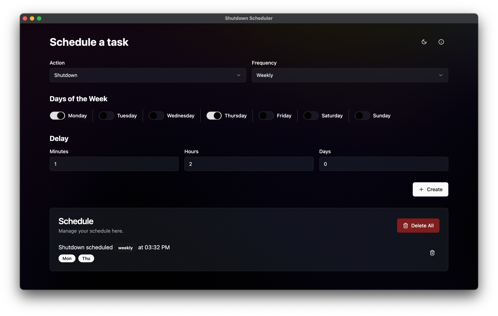

# Shutdown Scheduler

An Electron-powered desktop app for scheduling automated shutdown and reboot tasks. Built with Vite, React, and TypeScript, it supports Windows, Linux, macOS, and Unix-like systems. The app uses Task Scheduler on Windows and Cron jobs on Linux/Unix for seamless, platform-specific automation.

## Screenshots


_Main interface._

## Features

- **Flexible Scheduling**: Set shutdowns or reboots to occur once, daily, or weekly.
- **Task Management**: Enable, disable, delete individual or all tasks.
- **Cross-Platform**: Compatible with Windows, Linux, Unix-like systems, and macOS.
- **User-Friendly**: Tasks managed via JSON, keeping a record of all scheduled activities.

## Technologies

- **Electron** for cross-platform desktop functionality
- **Vite** for fast development and bundling
- **Tailwind** for a modern responsive UI
- **TypeScript** for type safety
- **React** for a fast UI

## Prerequisites

- **Node.js** and **npm**
- **Electron**

## Setup

1. Clone the repository and install dependencies:

   ```bash
   git clone https://github.com/hichemfantar/ShutdownScheduler
   cd ShutdownScheduler
   npm install
   ```

2. **Run the app in development mode**:

   ```bash
   npm run dev
   ```

3. **Package application**:

   ```bash
   npm run package
   ```

4. **Generate platform specific distributables**:

   ```bash
   npm run make
   ```

## Usage

- **Set up tasks**:
  - Define your task schedule type (once, daily, or weekly), action (shutdown/reboot), and timing options.
- **Enable/Disable**: Manage tasks through the app, adjusting schedules as needed.

## Platform-Specific Details

- **Windows**: Utilizes Windows Task Scheduler to set up shutdown/reboot tasks.
- **Linux/Unix/macOS**: Uses Cron jobs for scheduling tasks.

## Architecture

When building a shutdown timer across Windows, Linux, and Mac in an Electron app, you have two main options:

1. **Using OS-Specific Schedulers** (e.g., Task Scheduler on Windows, Cron on Unix-based systems)
2. **Using a Node.js Scheduler** (e.g., `node-schedule` or `node-cron`)

Each approach has its advantages and trade-offs. Here’s a breakdown to help you choose the best approach.

## 1. (current approach) Using OS-Specific Schedulers (Task Scheduler on Windows, Cron on Unix)

### Pros

- **Reliability and Consistency**: OS schedulers are designed specifically for managing scheduled tasks like shutdowns, making them more reliable, especially if the system sleeps or restarts.
- **Persistence**: These schedules will remain active even if your app closes or the computer restarts.
- **Low Resource Usage**: OS schedulers consume fewer resources than a continuously running Node.js process.

### Cons

- **Complex Cross-Platform Code**: Managing OS-specific schedulers increases code complexity, requiring separate logic for Windows (Task Scheduler) and Unix-based systems (Cron).
- **Permissions**: Setting up and modifying tasks in Task Scheduler and Cron may require elevated permissions, adding complexity to installation and operation.

### Recommended for

Applications needing high reliability for shutdown scheduling across various OS platforms, especially where persistence is key and where managing platform-specific configurations is acceptable.

---

## 2. Using a Node.js Scheduler (e.g., `node-schedule` or `node-cron`)

### Pros

- **Cross-Platform Code**: Node.js schedulers allow you to write unified code that works across all platforms, reducing the need for platform-specific logic.
- **Easy Integration in Electron**: Scheduling logic is directly within your Node.js code, making it straightforward to integrate with your Electron app's UI.
- **Fine-Grained Control**: Node.js schedulers allow custom intervals, task cancellation, or timing adjustments directly in your app.

### Cons

- **App Must Remain Running**: For the shutdown task to execute, the Node.js process must keep running, which can be problematic if the app closes or the user manually exits.
- **Potential Reliability Issues**: If the system sleeps, hibernates, or reboots, Node.js schedulers may not reliably trigger the shutdown.

### Recommended for

Situations where simplicity and cross-platform support in the codebase are priorities, and where the app will stay open (e.g., minimized to the system tray) to keep the Node.js process active.

---

## Conclusion

If you need a reliable, persistent shutdown scheduler that works even when the app isn’t running, **using OS-specific schedulers (Task Scheduler and Cron) is generally the better choice**. However, if you prefer a unified codebase and can ensure the app remains open, **a Node.js scheduler would be simpler to implement and maintain**.

### Hybrid Approach

Consider a hybrid approach: use a Node.js scheduler within the app for simplicity, and optionally set up OS-specific tasks if the user needs shutdown persistence outside of the app's runtime.

---

Enjoy automated scheduling with customizable options across platforms!
